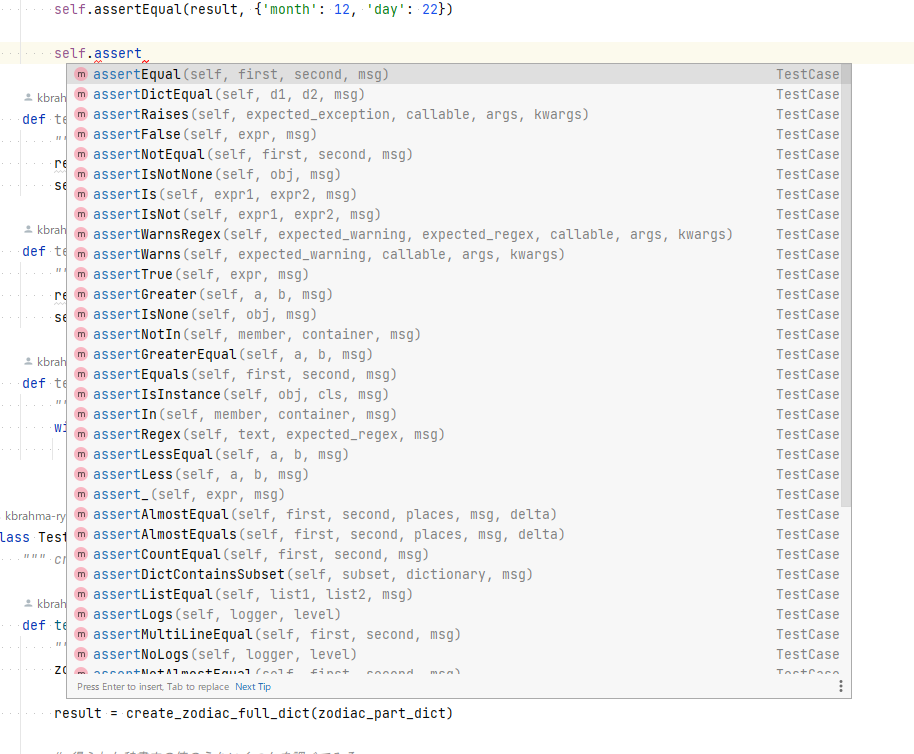

# unittest

[Python 公式ドキュメント unittest --- ユニットテストフレームワーク](https://docs.python.org/ja/3/library/unittest.html)

## インストール

unittest は、Python に標準でバンドルされています。  
なので、 `pip` コマンド等の実行なしですぐに使えます。

## unittest が実行するテストの要件

unittest が実行するテストは、以下の要件を満たさなくてはなりません。

| 項目       | 要件                                   | 例                                 |
|----------|--------------------------------------|-----------------------------------|
| テストモジュール | `test` で始まるモジュール名にする                 | `test_example.py`                 |
| テストクラス   | `unittest.TestCase` クラスのサブクラスにする(*1) | `class TestExampleFunc(TestCase)` |
| テストメソッド  | `test` で始まるメソッド名にする(*2)              | `def test_method_name()`          |

> unittest は、関数では実行できません
>
> (*1) 可読性および pytest からも利用可能にするために、`Test` ではじまる名称にするのが良いでしょう
> (*2) 可読性および pytest からも利用可能にするために、`test` ではじまる名称にするのが良いでしょう

## アサーション

unittest でも、 pytest と同様に、アサーションに `assert` 文を使うことができます。

ですが、 `unittest.TestCase` にはさまざまな assert メソッドが用意されているので、これらを使うのが一般的です。  
assert メソッドは、引数を受け取ってこれらを評価し、問題があった場合は `AssertionError` を発生させます。

assert メソッド の例を以下に示します。

| メソッド名                 | 概要                             | 使用例                                   |
|-----------------------|--------------------------------|---------------------------------------|
| `assertEqual`         | 2つの値が等しいことを確認する。               | `self.assertEqual(a, b)`              |
| `assertNotEqual`      | 2つの値が等しいことを確認する。               | `self.assertNotEqual(a, b)`           |
| `assertGreater`       | 第1引数が第2引数より大きいことを確認する。         | `self.assertGreater(a, b)`            |
| `assertGreaterEqual`  | 第1引数が第2引数と同じかより大きいかということを確認する。 | `self.assertGreaterEqual(a, b)`       |
| `assertLess`          | 第1引数が第2引数より小さいことを確認する。         | `self.assertLess(a, b)`               |
| `assertLessEqual`     | 第1引数が第2引数と同じかより小さいということを確認する。  | `self.assertLessEqual(a, b)`          |
| `assertTrue`          | 引数が `True` であることを確認する。         | `self.assertTrue(a)`                  |
| `assertFalse`         | 引数が `False` であることを確認する。        | `self.assertFalse(a)`                 |
| `assertIs`            | 2つの値が同じオブジェクトであることを確認する。       | `self.assertIs(a, b)`                 |
| `assertIsNot`         | 2つの値が異なるオブジェクトであることを確認する。      | `self.assertIsNot(a, b)`              |
| `assertIsNone`        | 引数が `None` であることを確認する。         | `self.assertIsNone(a)`                |
| `assertIsNotNone`     | 引数が `None` でないことを確認する。         | `self.assertIsNotNone(a)`             |
| `assertIn`            | 第1引数が第2引数に含まれることを確認する。         | `self.assertIn(a, b)`                 |
| `assertNotIn`         | 第1引数が第2引数に含まれないことを確認する。        | `self.assertNotIn(a, b)`              |
| `assertIsInstance`    | 第1引数が第2引数のインスタンスであることを確認する。    | `self.assertIsInstance(a, b)`         |
| `assertNotIsInstance` | 第1引数が第2引数のインスタンスでないことを確認する。    | `self.assertNotIsInstance(a, b)`      |
| `assertDictEqual`     | 2つの辞書が等しいことを確認する。              | `self.assertDictEqual(a, b)`          |
| `assertListEqual`     | 2つのリストが等しいことを確認する。             | `self.assertListEqual(a, b)`          |
| `assertTupleEqual`    | 2つのタプルが等しいことを確認する。             | `self.assertTupleEqual(a, b)`         |
| `assertRaises`        | 所定の `Exception` が発生することを確認する。  | `with self.assertRaises(ValueError):` |

IDE のオートコンプリート機能等の支援機能も活用しましょう。



### 例外のテスト記述方法

`assertRaises` を使うと、例外のテストを記述できます。  
`assertRaises` は、通常、`with` 文と組み合わせて使います。

```python
class TestGetZodiacSignName(TestCase):
    def test_get_zodiac_sign_name_raise(self):
        """ with を使った 例外テストの書き方 """
        with self.assertRaises(ValueError):
            get_zodiac_sign_name(13, 31)
```

以下に示すように `with` 文を使わない書き方もできます。  
しかし、どちらかというと、`with` 文を使った書き方が好まれます。

```python
class TestGetZodiacSignNameNoWith(TestCase):
    def test_get_zodiac_sign_name_raise_now_with(self):
        """  with を使わない 例外テストの書き方 """
        self.assertRaises(ValueError, get_zodiac_sign_name, 13, 31)
```

## コマンドラインからの実行

[参考: 公式ドキュメント unittest --- ユニットテストフレームワーク テストディスカバリ](https://docs.python.org/ja/3/library/unittest.html#test-discovery)  
unittest は、以下のコマンドで実行できます。

```shell
python -m unittest
```

`python -m unittest` コマンドで呼び出されるテストランナーは、主に、以下のような処理を行います。

1. カレントディレクトリからテストファイルを探し、自動的にテストコレクションを行います。
2. テストコレクションでは、unittest の命名規則に従ったテストファイル、テストクラス、テストメソッドが自動的に検出されます。
3. 検出されたテストを実行し、テスト結果を表示します。
4. テスト結果の詳細なレポートを表示します。

テスト対象(テストスイート)を絞りこんで実行することもできます。

`discover` オプションはテスト対象を絞りこむときに使うものです。  
もっとも、 `discover` オプションでの複雑な絞りこみの方法を知る必要はありません。  
とりあえず、「`discover` オプションを指定すると、下位のパッケージ、モジュールをすべてテスト対象にする」ということだけ覚えておいてください。

```shell
# 特定のパッケージ以下のすべてのテストを実行する:
# discover は、下位のパッケージ、モジュールをすべて探索してテストを実行します
python -m unittest discover tests

# 特定のモジュール内のすべてのテストを実行する:
python -m unittest test_module
python -m unittest tests.test_in_dir

# 特定のモジュール内の特定のテストクラスを実行する:
python -m unittest test_module.TestUnitTestClass
python -m unittest tests.test_in_dir.TestUnitTestClass

#モジュール内の特定のクラスの特定のテストメソッドを実行する:
python -m unittest test_module.TestUnitTestClass.test_method
python -m unittest tests.test_in_dir.TestUnitTestClass.test_method

```

## テストレポート

テストの実行結果は、以下の例のように表示されます。

以下は、すべてのテストが成功した場合の表示例です。

```shell
(venv) PS D:\project_dir> python -m unittest
.......................
----------------------------------------------------------------------
Ran 23 tests in 0.006s

OK
```

以下は、失敗したテストがあった場合の表示例です。

```shell
(venv) PS D:\project_dir> python -m unittest 
.................F.F...
======================================================================
FAIL: test_last_day_of_capricorn (tests.unittests.unittests.TestGetZodiacSignNameDict.test_last_day_of_capricorn)
山羊座の最終日についてテスト
----------------------------------------------------------------------
Traceback (most recent call last):
  File "D:\project_dir\tests\test_unittest\test_unittest.py", line 89, in test_last_day_of_capricorn
    self.assertEqual(result, 'ギョーザ')
AssertionError: '山羊座' != 'ギョーザ'
- 山羊座
+ ギョーザ


======================================================================
FAIL: test_mid_day_of_aquarius (tests.unittests.unittests.TestGetZodiacSignNameDict.test_mid_day_of_aquarius)
水瓶座の中間日についてテスト
----------------------------------------------------------------------
Traceback (most recent call last):
  File "D:\project_dir\unit_test_samples\tests\test_unittest\test_unittest.py", line 99, in test_mid_day_of_aquarius
    self.assertEqual(result, '権力の座')
AssertionError: '水瓶座' != '権力の座'
- 水瓶座
+ 権力の座


----------------------------------------------------------------------
Ran 23 tests in 0.007s

FAILED (failures=2)
```

## `unittest.TestCase` クラスのそのほかの主要メソッド

以下のメソッドを使って、テストメソッド前後で行う処理を定義できます。  
複数のテストメソッドで共通の前処理、後処理を実装したい場合に便利です。

| メソッド名           | メソッドタイプ        | 呼び出しのタイミング                        | 使用目的                              |
|-----------------|----------------|-----------------------------------|-----------------------------------|
| `setUpClass`    | クラスメソッド        | テストクラス内の<br>最初のテストメソッドが<br>実行される前 | すべてのテストメソッドで<br>使用する変数やファイルの生成に使う |
| `tearDownClass` | クラスメソッド        | テストクラス内の<br>全てのテストメソッドが<br>実行された後 | すべてのテストメソッドで<br>生成されたファイルの削除などに使う |
| `setUp`         | インスタンス<br>メソッド | 各テストメソッドが<br>実行される前               | 個々のテストメソッドで<br>使用する変数やファイル等の生成に使う |
| `tearDown`      | インスタンス<br>メソッド | 各テストメソッドが<br>実行された後               | 個々のテストメソッドで<br>生成されたファイルの削除などに使う  |

> 後処理の例としては、以下のようなものが考えられます。
>
> - テストメソッド内で作成したファイルを削除する
> - テストメソッド内でレコード編集したデータベースのロールバックを行う

以下、これらのメソッドの利用にかかる注意点です。

1. `setUpClass` で作ったクラス変数の値をテストメソッド内で変更しない
2. 親クラスで実装されたメソッドを実行する必要がある場合は `super()` で呼び出して実行する
3. `tearDown`, `tearDownClass` は、テストメソッドが異常終了したときも実行される

### 1. `setUpClass` で作ったクラス変数の値をテストメソッド内で変更しない

`setUpClass` で作ったクラス変数の値をテストメソッド内で変更しないようにしましょう。

`setUpClass` は、すべてのテストが実行される前のタイミングで一度だけ実行されるクラスメソッドです。

<span style="color: red;">クラス変数は、その後実行されるすべてのメソッドが参照可能です。</span>  
にも関わらずテストメソッド内でこのクラス変数の値を変更してしまうと、他のテストメソッドの実行結果に影響を与えてしまいます。  
<span style="color: red;">セットアップ後に値を変更したい変数については、 `setUpClass` ではなく、 `setUp` で作成するようにしましょう。</span>

### 2. 親クラスで実装されたメソッドを実行する必要がある場合は `super()` で呼び出して実行する

上に紹介したいずれのメソッドについても、 `super()` を使って親クラスのメソッドを呼び出すことができます。  
`unittest.TestCase` はクラスなので、当然と言えば当然ですね。  
`unittest.TestCase` を継承したクラスを使う際はこの点に気をつけてください。

### 3. `tearDown`, `tearDownClass` は、テストメソッドが異常終了したときも実行される

`tearDown`, `tearDownClass` は、テストメソッドが異常終了したときも実行されます。

> <span style="color: red;">ただし、後述のとおり、 `django.test.TestCase` では、テストメソッドが異常終了したときはこれらのメソッドは実行されません。</span>

以下は、これらのメソッドを使ったサンプルコードです。

test_module.py

```python
from unittest import TestCase


class TestUnitTestMethodSample(TestCase):
    """ get_zodiac_sign_name_dict のテスト """

    @classmethod
    def setUpClass(cls):
        # super().setUpClass()
        print('\nsetUpClass は一度だけ実行されます')

    def setUp(self):
        print('\nsetUp はテストメソッド毎に実行されます')
        # super().setUp()

    def tearDown(self):
        print('tearDown はテストメソッド毎に実行されます')
        # super().tearDown()

    @classmethod
    def tearDownClass(cls):
        print('\ntearDownClass は一度だけ実行されます')
        # super().tearDownClass()

    def test_1(self):
        print('test_1')

    def test_2(self):
        print('test_2')

    def test_3(self):
        print('test_3')
```

実行結果:

```shell
(venv) PS D:\project_dir> python -m unittest test_module.TestUnitTestMethodSample

setUpClass は一度だけ実行されます


setUp はテストメソッド毎に実行されます
test_1
tearDown はテストメソッド毎に実行されます
.
setUp はテストメソッド毎に実行されます
test_2
tearDown はテストメソッド毎に実行されます
.
setUp はテストメソッド毎に実行されます
test_3
tearDown はテストメソッド毎に実行されます
.
tearDownClass は一度だけ実行されます

----------------------------------------------------------------------
Ran 3 tests in 0.001s

OK
```

以下は、実装例です。

tests/test_unittest/test_unittest.py

```python
import unittest
from zodiac import (
    get_zodiac_sign_name_dict, get_zodiac_part_dict, create_zodiac_full_dict)


class TestGetZodiacSignNameDict(unittest.TestCase):
    """ get_zodiac_sign_name_dict のテスト """

    @classmethod
    def setUpClass(cls):
        zodiac_part_data = get_zodiac_part_dict()
        cls.zodiac_full_dict = create_zodiac_full_dict(zodiac_part_data)

    def test_first_day_of_year(self):
        """ 年初の山羊座の最終日前についてテスト """
        result = get_zodiac_sign_name_dict(1, 1, self.zodiac_full_dict)
        self.assertEqual(result, '山羊座')

    def test_last_day_of_capricorn(self):
        """ 山羊座の最終日についてテスト """
        result = get_zodiac_sign_name_dict(1, 19, self.zodiac_full_dict)
        self.assertEqual(result, '山羊座')

    def test_first_day_of_aquarius(self):
        """ 水瓶座の開始日についてテスト """
        result = get_zodiac_sign_name_dict(1, 20, self.zodiac_full_dict)
        self.assertEqual(result, '水瓶座')

    def test_mid_day_of_aquarius(self):
        """ 水瓶座の中間日についてテスト"""
        result = get_zodiac_sign_name_dict(1, 25, self.zodiac_full_dict)
        self.assertEqual(result, '水瓶座')

    def test_last_day_of_year(self):
        """ 年末の射手座最終日以降についてテスト """
        result = get_zodiac_sign_name_dict(12, 25, self.zodiac_full_dict)
        self.assertEqual(result, '山羊座')

    def test_raise(self):
        """ 不正な日付で例外が発生することを確認する """
        with self.assertRaises(ValueError):
            get_zodiac_sign_name_dict(13, 31, self.zodiac_full_dict)

    def test_raise_no_with(self):
        """  with を使わない 例外テストの書き方 """
        self.assertRaises(
            ValueError, get_zodiac_sign_name_dict, 13, 31, self.zodiac_full_dict)
```

以下は、テストメソッドが異常終了したときの流れを示すサンプルです。  
テストメソッドが異常終了した場合も、 `tearDown`, `tearDownClass` は実行されます。

tests/unittests/test_raise.py

```python
""" unittest が異常終了する場合のサンプル """
import inspect
import unittest


class TestRaiseSample(unittest.TestCase):
    @classmethod
    def setUpClass(cls):
        """ すべてのテストが開始する前に一度だけ呼ばれる """
        print(cls.__name__, 'setUpClass')

    def setUp(self):
        """ 各テストが開始する前に呼ばれる """
        print(self.__class__.__name__, 'setUp')

    def tearDown(self):
        """ テストが異常終了しても呼ばれる """
        method_name = inspect.stack()[0][3]
        print(self.__class__.__name__, method_name)

    @classmethod
    def tearDownClass(cls):
        """ テストが異常終了しても呼ばれる """
        print(cls.__name__, 'tearDownClass')

    def test_ok(self):
        """ 成功するテスト """
        method_name = inspect.stack()[0][3]
        print(self.__class__.__name__, method_name)

        self.assertEqual(1, 1)

    def test_raise1(self):
        """ raise して異常終了 """
        method_name = inspect.stack()[0][3]
        print(self.__class__.__name__, method_name)

        a = 3 / 0
        self.assertEqual(a, 0)

    def test_raise2(self):
        """ raise して異常終了 """
        method_name = inspect.stack()[0][3]
        print(self.__class__.__name__, method_name)

        b = "hoge" + 3
        self.assertEqual(b, "hoge3")

    def test_success(self):
        """ 成功するテスト """
        method_name = inspect.stack()[0][3]
        print(self.__class__.__name__, method_name)

        self.assertEqual(1, 1)
```

```shell
(venv) PS D:\projectdir> python -m unittest tests.unittests.test_raise
TestRaiseSample setUpClass
TestRaiseSample setUp
TestRaiseSample test_ok
TestRaiseSample tearDown
.TestRaiseSample setUp
TestRaiseSample test_raise1
TestRaiseSample tearDown
ETestRaiseSample setUp
TestRaiseSample test_raise2
TestRaiseSample tearDown
ETestRaiseSample setUp
TestRaiseSample test_success
TestRaiseSample tearDown
.TestRaiseSample tearDownClass

======================================================================
ERROR: test_raise1 (tests.unittests.test_raise.TestRaiseSample)
raise して異常終了
----------------------------------------------------------------------
Traceback (most recent call last):
  File "D:\projects\lessons\unit_test_samples\tests\unittests\test_raise.py", line 38, in test_raise1
    a = 3 / 0
ZeroDivisionError: division by zero

======================================================================
ERROR: test_raise2 (tests.unittests.test_raise.TestRaiseSample)
raise して異常終了
----------------------------------------------------------------------
Traceback (most recent call last):
  File "D:\projects\lessons\unit_test_samples\tests\unittests\test_raise.py", line 46, in test_raise2
    b = "hoge" + 3
TypeError: can only concatenate str (not "int") to str

----------------------------------------------------------------------
Ran 4 tests in 0.143s

FAILED (errors=2)
```

## やや高度な手法

### `unittest.TestCase.subTest`

`self.subTest` を使用すると、複数のテストを1つのテストメソッドで記述できます。  
同じ構造のテストを複数実行する場合に使います。  
pytest の `@pytest.mark.parametrize` デコレータと同様です。

tests/test_unittest/test_advanced.py

```python
import unittest

from zodiac import get_zodiac_sign_name


class TestGetZodiacSignName(unittest.TestCase):
    """ get_zodiac_sign_name のテスト """

    def test_values(self):
        """ 様々な日付について連続的にテスト
        年初の山羊座の最終日前   :  1月 1日
        山羊座の最終日          :  1月19日
        水瓶座の開始日          :  1月20日
        水瓶座の中間日          :  2月 9日
        年末の射手座の最終日以降 : 12月25日
        """
        test_cases = [
            (1, 1, '山羊座'),
            (1, 19, '山羊座'),
            (1, 20, '水瓶座'),
            (1, 25, '水瓶座'),
            (12, 25, '山羊座'),
        ]
        for month, day, expected in test_cases:
            with self.subTest(month=month, day=day):
                result = get_zodiac_sign_name(month, day)
                self.assertEqual(result, expected)
```

以下は、失敗したテストがあった場合のテストの実行結果表示例です。  
テストメソッドは1つしか記述していませんが、5つのテストが実行され、そのうちの2つについてエラーが出ています。

```shell
(venv) PS D:\projects_dir> python -m unittest tests.unittests.test_advanced.TestGetZodiacSignName -v
test_values (tests.unittests.test_advanced.TestGetZodiacSignName.test_values)
様々な日付について連続的にテスト ...
  test_values (tests.unittests.test_advanced.TestGetZodiacSignName.test_values) (month=1, day=19)
様々な日付について連続的にテスト ... FAIL
  test_values (tests.unittests.test_advanced.TestGetZodiacSignName.test_values) (month=1, day=25)
様々な日付について連続的にテスト ... FAIL

======================================================================
FAIL: test_values (tests.unittests.test_advanced.TestGetZodiacSignName.test_values) (month=1, day=19)
様々な日付について連続的にテスト
----------------------------------------------------------------------
Traceback (most recent call last):
  File "D:\project_dir\unit_test_samples\tests\test_unittest\test_advanced.py", line 91, in test_values
    self.assertEqual(result, expected)
AssertionError: '山羊座' != 'ギョーザ'
- 山羊座
+ ギョーザ


======================================================================
FAIL: test_values (tests.unittests.test_advanced.TestGetZodiacSignName.test_values) (month=1, day=25)
様々な日付について連続的にテスト
----------------------------------------------------------------------
Traceback (most recent call last):
  File "D:\project_dir\unit_test_samples\tests\test_unittest\test_advanced.py", line 91, in test_values
    self.assertEqual(result, expected)
AssertionError: '水瓶座' != '権力の座'
- 水瓶座
+ 権力の座


----------------------------------------------------------------------
Ran 1 test in 0.003s

FAILED (failures=2)
```
