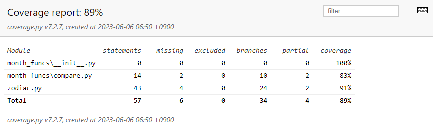
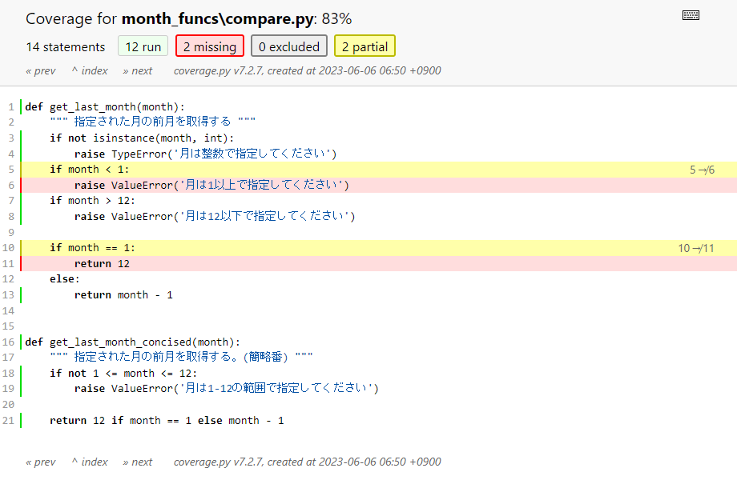

# Coverage.py

[Coverage.py 公式ドキュメント](https://coverage.readthedocs.io)

## コードカバレッジ（Code Coverage）とは

コードカバレッジ（Code Coverage）という言葉があります。

コードカバレッジは、テストの品質と信頼性を測るための指標です。

具体的には、ユニットテストによって、コードのどの行や分岐が実行されたか、または実行されなかったかを調べます。  
そして、すべてのコードのうちのどの程度の割合が実行されたかを測定します。この割合の数値は、テストの品質と信頼性についてのある程度の担保となります。

## コードカバレッジ計測ツール Coverage.py

Python プログラムのコードカバレッジを計測するためのツールとして、[Coverage.py](https://coverage.readthedocs.io) があります。

この資料では、 Coverage.py の基本的な使用方法と主な機能について説明します。

なお、 Coverage.py のことを、単に Coverage と呼ぶこともあります。  
以後、本講座でも、 Coverage という呼び方をします。

## インストール

Coverage のインストールは、pip で行います。

```shell
pip install coverage
```

## Coverage の使用方法

Coverage は、コマンドラインから実行できます。

以下は基本的な使用方法です。

1. テストを実行しながらカバレッジを計測する

カバレッジを計測するには、以下の例のような書き方でテストランナーを実行します。

```shell
# pytest を使用する場合の例
coverage run -m pytest

# unitest を使用する場合の例
coverage run -m unittest

# Django のユニットテストを実行する場合の例
coverage run manage.py test
```

すると、 Coverage は、指定されたテストスイートのテストを実行しながらカバレッジデータを収集します。

2. カバレッジレポートを表示する

カバレッジレポートを表示するには、次のコマンドを使用します。

```shell
coverage report
```

このコマンドは、コンソールにカバレッジレポートを表示します。  
各モジュール内のコードのどの程度の割合が実行されたかを測定した結果が表示されます。

以下は、カバレッジレポートの例です。

```shell
(venv) PS D:\project_dir> coverage report
Name                      Stmts   Miss Branch BrPart  Cover
-----------------------------------------------------------
month_funcs\__init__.py       0      0      0      0   100%
month_funcs\compare.py       14      2     10      2    83%
zodiac.py                    43      4     24      2    91%
-----------------------------------------------------------
TOTAL                        57      6     34      4    89%
```

3. HTML形式のカバレッジレポートを生成する

HTML形式のカバレッジレポートを生成するには、次のコマンドを使用します。

 ```shell
coverage html
```

このコマンドは、 `htmlcov` ディレクトリにHTMLレポートを生成します。  
`index.html` ファイルをウェブブラウザで開いて詳細なカバレッジレポートを表示できます。

以下は、HTMLカバレッジレポートの例です。



各モジュールごとの詳細を出力することもできます。  
実行されなかった行や、条件分岐のすべてがカバーされなかった行は、以下のように色つきで表示されます。



## .coveragerc ファイル

Coverage の設定は、`.coveragerc` ファイルによってカスタマイズできます。  
`.coveragerc` ファイルでは、特定のファイルやディレクトリの除外、報告されるカバレッジの形式、カバレッジのしきい値などの設定を指定できます。

`.coveragerc` ファイルは、カバレッジの計測を行う対象のプロジェクトのトップレベルディレクトリに置いてください。

以下は、 `.coveragerc` ファイルの例です。

```ini
[run]
omit = */manage.py
       */migrations/*
       tests/*
       *test_*.py
```

.coveragerc には、以下のような設定項目があるようです。  
興味と必要の程度に応じて調べてみてください。

| カテゴリ     | キー            | 説明                                |
|----------|---------------|-----------------------------------|
| [run]    | branch        | 分岐カバレッジを有効にするかどうかのフラグ             |
|          | concurrency   | 並行処理を使用してテストを実行するかどうかのフラグ         |
|          | data_file     | カバレッジデータの保存先ファイルのパス               |
|          | parallel      | 並行処理を有効にするかどうかのフラグ                |
|          | source        | ソースコードのディレクトリまたはモジュールのパス          |
|          | include       | カバレッジレポートに含めるファイルまたはディレクトリのパターン   |
|          | omit          | カバレッジレポートから除外するファイルまたはディレクトリのパターン |
|          | plugins       | 使用するカバレッジプラグインの指定                 |
| [report] | exclude_lines | レポートから除外する行のパターン                  |
|          | precision     | パーセンテージの表示精度                      |
|          | show_missing  | カバレッジレポートで欠損行を表示するかどうかのフラグ        |
| [html]   | directory     | HTMLレポートの出力ディレクトリのパス              |
|          | title         | HTMLレポートのタイトル                     |
| [xml]    | output        | XMLレポートの出力ファイルのパス                 |
|          | package       | パッケージレベルのカバレッジ情報を含めるパッケージのパス      |
| [paths]  | source        | ソースコードのディレクトリまたはモジュールのパス          |
|          | data_coverage | カバレッジデータのパス                       |
|          | relative      | パスの相対指定を有効にするかどうかのフラグ             |

[Coverage.py 公式ドキュメント Configuration reference - syntac](https://coverage.readthedocs.io/en/latest/config.html#syntax)

## コードカバレッジは、あくまで、「品質のひとつの指標」

コードカバレッジは、あくまで、品質のひとつの指標にしかすぎません。

100%ならば、良いテストコードだとは限りません。  
また、100%でなくても、そのことが即座に品質に問題があるということにはなりません。

「ユニットテストとは」の章で紹介した以下のコードについて考えてみましょう。

month_funcs/compare.py

```python
def get_last_month(month):
    """ 指定された月の前月を取得する。

    :param month: 月を表す整数
    :return: 月を表す整数
    """
    if not isinstance(month, int):
        raise TypeError('月は整数で指定してください')
    if month < 1:
        raise ValueError('月は1以上で指定してください')
    if month > 12:
        raise ValueError('月は12以下で指定してください')

    if month == 1:
        return 12
    else:
        return month - 1
```

上記のコードでは、分岐は合計5つです。   
以下のような5つのテストコードを用意すれば、この関数についてのカバレッジを100%にすることができます。

month_funcs/test_last_month_funcs.py

```python
import pytest

from month_funcs.compare import get_last_month


def test_not_int():
    """ 整数以外はエラー """
    with pytest.raises(TypeError):
        get_last_month('hoge')


def test_month_0():
    """ 0月はエラー """
    with pytest.raises(ValueError):
        get_last_month(0)


def test_over_month():
    """ 13月はエラー """
    with pytest.raises(ValueError):
        get_last_month(13)


def test_january():
    """ 1月の前月は12月 """
    assert get_last_month(1) == 12


def test_february():
    """ 1月以外の任意の月でテスト """
    assert get_last_month(2) == 1
```

ところで、以下ではどうでしょうか。
以下のコードは、上に示した `get_last_month` とほぼ同じ機能を有しています。

month_funcs/compare.py

```python
def get_last_month_concised(month):
    """ 指定された月の前月を取得する。(簡略番)

    :param month: 月を表す整数
    :return: 月を表す整数
    """
    if not 1 <= month <= 12:
        raise ValueError('月は1-12の範囲で指定してください')

    return 12 if month == 1 else month - 1
```

この関数についてのカバレッジを100%にしたければ、以下のような2つのテストコードを用意すれば十分です。  
ですが、言うまでもなく、これらのテストだけで十分とは言えないでしょう。

month_funcs/test_last_month_funcs.py

```python
import pytest

from month_funcs.compare import get_last_month_concised


def test_raise():
    """ 例外が発生するケース """
    with pytest.raises(ValueError):
        get_last_month_concised(0)


def test_success():
    """ 戻り値を得られるケース """
    assert get_last_month_concised(2) == 1
```

```shell
(venv) PS D:\project_dir> coverage report        
Name                      Stmts   Miss Branch BrPart  Cover
-----------------------------------------------------------
month_funcs\__init__.py       0      0      0      0   100%
month_funcs\compare.py       14      0     10      0   100%
-----------------------------------------------------------
TOTAL                        14      0     10      0   100%
```

コードカバレッジは、あくまで、以下についての調査用のツールでしかありません。

- コードのどの行や分岐が実行されたか、または実行されなかったか
- すべてのコードのうちのどの程度の割合が実行されたか

「テストすべきテストケースのすべてについてテストが実施されたか」ということを判断するには、コードカバレッジだけでは不十分です。

また、コードカバレッジの数字が100%でなくても、そのことが即座に品質に問題があるということにはなりません。  
(実際、大規模なプロジェクトでは、100%にすることは困難です)

コードカバレッジは、あくまで、「品質のひとつの指標」にすぎません。  
コードの品質担保は、コードカバレッジ以外の方法も含めた総合的な判断で行うべきです。
